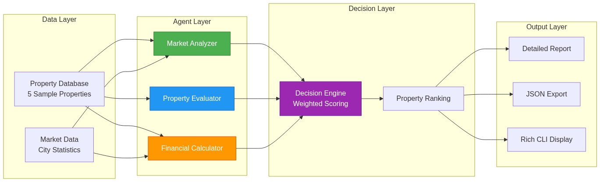
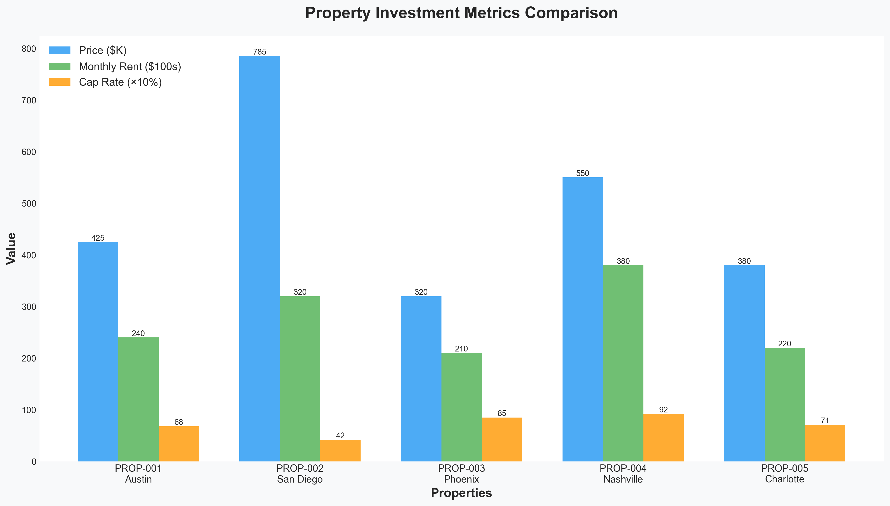
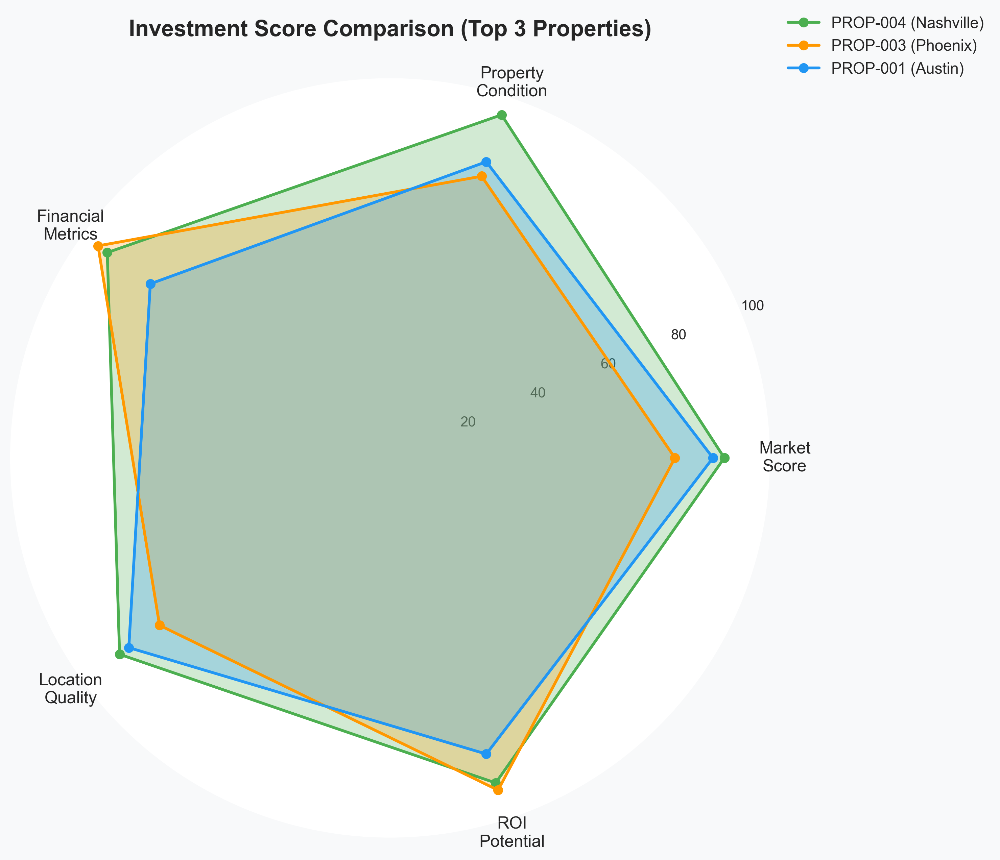
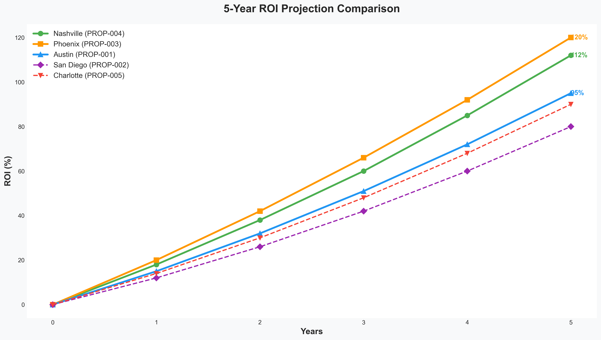
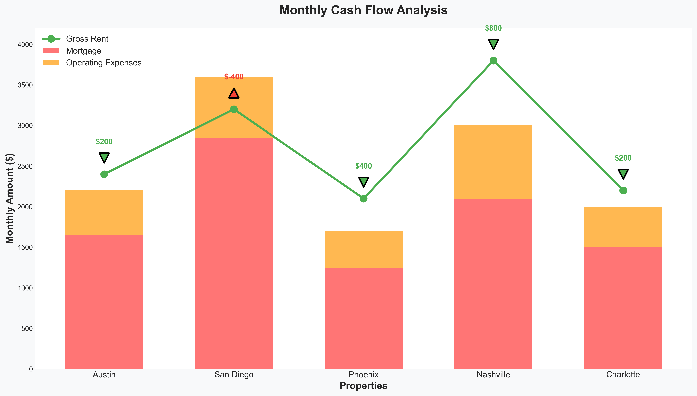

# AI-Powered Real Estate Investment Analyzer


An intelligent multi-agent system that automates real estate investment analysis, evaluating properties based on market conditions, financial metrics, and property quality to provide data-driven investment recommendations.

## Overview

This project demonstrates how AI agents can streamline the property investment decision-making process. Instead of manually analyzing spreadsheets, market reports, and financial calculations for hours, this system processes multiple properties in seconds and ranks them by investment potential.

**Key Features:**
- 🏠 **Multi-Property Analysis**: Evaluate multiple properties simultaneously
- 🤖 **4 Specialized AI Agents**: Market Analyzer, Property Evaluator, Financial Calculator, Decision Engine
- 📊 **Comprehensive Metrics**: Cap rate, cash-on-cash return, 5-year ROI projections
- 🎯 **Investment Grading**: A+ to D grading system with confidence scores
- 📈 **Visual Analytics**: Statistical charts and detailed reports
- 💰 **Cash Flow Modeling**: Monthly and annual cash flow projections

## Architecture



The system uses a modular agent architecture where each agent has a specific responsibility:

1. **Market Analyzer**: Evaluates location quality, appreciation rates, and neighborhood characteristics
2. **Property Evaluator**: Assesses property condition, pricing vs. market average, and renovation potential
3. **Financial Calculator**: Computes cap rate, ROI, cash flow, and break-even timelines
4. **Decision Engine**: Synthesizes all analyses into weighted scores and final recommendations

## Installation

### Prerequisites
- Python 3.12+
- pip

### Setup

1. **Clone the repository**
```bash
git clone https://github.com/YOUR_USERNAME/real-estate-investment-analyzer.git
cd real-estate-investment-analyzer
```

2. **Create virtual environment**
```bash
python3 -m venv venv
source venv/bin/activate  # On Windows: venv\Scripts\activate
```

3. **Install dependencies**
```bash
pip install -r requirements.txt
```

## Usage

Run the analyzer:
```bash
python main.py
```

The system will:
1. Initialize all AI agents
2. Load sample properties (5 diverse scenarios)
3. Analyze each property across all dimensions
4. Display a ranked summary table
5. Show detailed report for the top investment opportunity
6. Export results to `analysis_results.json`

## Sample Output

```
================================================================================
                    INVESTMENT ANALYSIS SUMMARY
================================================================================

Property ID  City        Price      Grade  Score  Cap Rate  Cash Flow  Recommendation
────────────────────────────────────────────────────────────────────────────────────
PROP-004     Nashville   $550,000   A+     92.3   9.2%      $800       Strong Buy
PROP-003     Phoenix     $320,000   A-     87.8   8.5%      $400       Strong Buy
PROP-001     Austin      $425,000   B+     78.5   6.8%      $200       Buy
PROP-005     Charlotte   $380,000   B      75.2   7.1%      $200       Buy
PROP-002     San Diego   $785,000   B-     68.4   4.2%      -$400      Pass
```

## Investment Metrics Explained

### Cap Rate (Capitalization Rate)
```
Cap Rate = (Net Operating Income / Property Price) × 100
```
- **Excellent**: > 8%
- **Good**: 6-8%
- **Average**: 4-6%
- **Weak**: < 4%

### Cash-on-Cash Return
```
Cash-on-Cash = (Annual Cash Flow / Total Cash Invested) × 100
```
Measures the annual return on your actual cash investment (down payment + closing costs).

### 5-Year ROI
Includes:
- Property appreciation
- Equity buildup through mortgage payments
- Cumulative cash flow
- Total gain vs. initial investment

## Visual Analytics

The system generates comprehensive visual analytics:


*Comparative analysis of key metrics across all properties*


*Multi-dimensional investment score visualization*


*5-year return on investment projections*


*Monthly cash flow breakdown*

## Project Structure

```
real-estate-investment-analyzer/
├── agents/
│   ├── market_analyzer.py      # Location & market analysis
│   ├── property_evaluator.py   # Property condition assessment
│   ├── financial_calculator.py # Investment metrics calculation
│   └── decision_engine.py      # Final recommendation synthesis
├── models/
│   └── property.py             # Data models
├── data/
│   └── mock_properties.py      # Sample property data
├── images/                     # Generated diagrams and charts
├── main.py                     # Main orchestration script
├── generate_diagrams.py        # Mermaid diagram generator
├── generate_charts.py          # Statistical chart generator
├── generate_gif.py             # Animated GIF generator
└── requirements.txt            # Dependencies
```

## Tech Stack

- **Python 3.12**: Core language
- **Rich**: Terminal UI and formatting
- **Matplotlib**: Statistical chart generation
- **Pillow**: Image processing and GIF creation
- **Requests**: Mermaid diagram fetching

## How It Works

### 1. Data Collection
The system loads property data including:
- Basic details (address, size, price)
- Financial information (rent estimates, taxes, HOA fees)
- Market context (city, neighborhood characteristics)

### 2. Multi-Agent Analysis
Each agent independently analyzes the property:
- **Market Analyzer**: Scores location quality (0-100) based on schools, crime, appreciation trends
- **Property Evaluator**: Assesses condition, identifies issues, compares price/sqft to market
- **Financial Calculator**: Runs detailed cash flow models with realistic assumptions

### 3. Decision Synthesis
The Decision Engine:
- Applies weighted scoring (40% financial, 30% market, 30% property)
- Assigns investment grade (A+ to D)
- Calculates confidence score based on metric consistency
- Generates human-readable rationale

### 4. Ranking & Reporting
Properties are ranked by overall score, with detailed breakdowns of:
- Key strengths and concerns
- Risk assessment
- Specific recommendations

## Customization

### Modify Financial Assumptions
Edit `agents/financial_calculator.py`:
```python
self.down_payment_pct = 0.20  # 20% down
self.interest_rate = 0.07     # 7% mortgage rate
self.vacancy_rate = 0.05      # 5% vacancy
```

### Adjust Scoring Weights
Edit `agents/decision_engine.py`:
```python
self.weights = {
    "financial": 0.40,  # Adjust as needed
    "market": 0.30,
    "property": 0.30
}
```

### Add Your Own Properties
Edit `data/mock_properties.py` to add real property data.

## Limitations & Disclaimers

- This is a **Proof of Concept (PoC)** for educational purposes
- Uses mock data and simplified assumptions
- **Not financial advice** - always consult with real estate professionals
- Real-world analysis requires:
  - Actual market data APIs (Zillow, Redfin)
  - Professional property inspections
  - Legal and tax considerations
  - Local market expertise

## Future Enhancements

- [ ] Integration with real estate APIs (Zillow, Redfin)
- [ ] Machine learning for appreciation predictions
- [ ] Comparative market analysis (CMA) automation
- [ ] Tax optimization strategies
- [ ] Multi-unit property analysis
- [ ] Web interface for easier access

## License

MIT License - feel free to use and modify for your own projects.

## Author

Built as an experimental project to explore AI agents in real estate investment analysis.

---

**Disclaimer**: This tool is for educational and experimental purposes only. Real estate investment involves significant financial risk. Always conduct thorough due diligence and consult with qualified professionals before making investment decisions.
